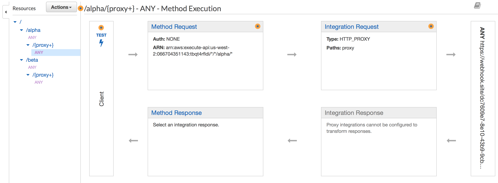

# AWS API Gateway microservice-to-subdomain mapping using terraform

## procedures

Initially, we create a API Gateway entrypoint, as seen [here](/modules/apigw/main.tf). Then, we configure the [endpoint internals](/modules/apigw/struct/main.tf), specifying the routes and what it will be linked to.

Every entry is composed by three components: *resource*, *method* and *integration*.

### Resource
[This](/modules/apigw/struct/main.tf#L8-L12) is where the configuration on what endpoint are we listening for requests is set. The `path_part` argument ahould contain a string that represents the endpoint path. AWS provides a [special handler](/modules/apigw/struct/main.tf#L46-L50) to listen all the requests, the "{proxy+}". Resources may be nested, just connect the `parent_id`to the correct place, like [this](https://github.com/paoloo/aws-apigw-msmap/blob/master/modules/apigw/struct/main.tf#L48).

### Method
In the [method](/modules/apigw/struct/main.tf#L14-L22) resource is where the specification of what the endpoint is listening is built. The `http_method` argument will have a string with the desired HTTP method. The *"ANY"* value is a special handler to accept any HTTP method.

### Integration
The [integration](/modules/apigw/struct/main.tf#L24-L34) resource is related to how to react to the received request.

After the basic structure is defined, it's required to o [map](/modules/apigw/deploy/main.tf#L14-L18) the domain configuration to the API gateway entry and, finally, [deploy](/modules/apigw/deploy/main.tf#L7-L11) the API gateway integration.



## run

to apply it, just go as usual:
```
terraform init
terraform plan
terraform apply
```

After that, a good thing to do is flush the DNS cache:
- on OSX:
```
sudo killall -HUP mDNSResponder
```
- on Windows:
```
ipconfig /flushdns
```
- on linux:
```
sudo /etc/init.d/dnsmasq restart
```

## Notes

1- we require an `us-east-1`-based AWS provider to extract the ACM certificate due to a restriction on API gateway, which can only handle certs from that region. For that, we have [this](main.tf#L7-L12).


